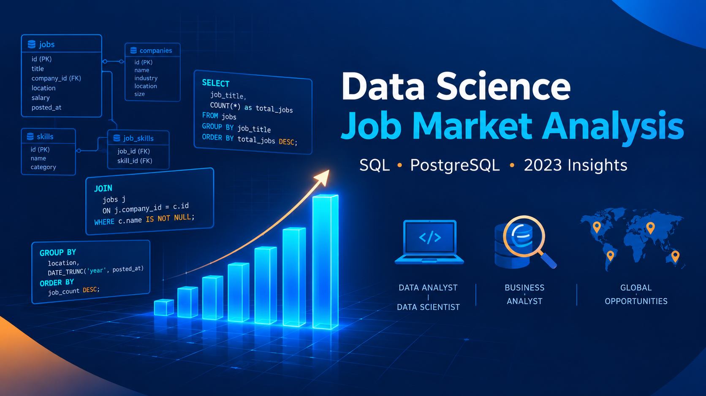

# Data Science Job Market Analysis Using SQL



## Introduction

📊 A deep-dive SQL analysis into the data science job market — uncovering 💰 top-paying roles, 🔥 in-demand skills, 📈 remote vs onsite salary gaps, and 🧩 how skills combine in real job postings.

🔍 SQL queries are organized in the [`project_sql/`](./project_sql/) folder.

---

## Background

This project was built to answer a practical question every aspiring data professional faces: **what should I learn, and where should I apply?** By querying a real dataset of job postings, companies, and required skills, the analysis goes beyond surface-level trends to highlight where demand, salary, and skill overlap.

Data comes from the [SQL Course by Luke Barousse](https://lukebarousse.com/sql), covering job titles, salaries, locations, companies, and required skills across 2023.

### Business Questions Answered

1. What are the top-paying data analyst jobs?
2. What skills are required for those top-paying jobs?
3. What skills are most in demand for data analysts?
4. Which skills are associated with higher salaries?
5. What are the most optimal skills to learn (high demand + high salary)?
6. Which companies hire the most data professionals, and how do their pay and remote-work patterns look?
7. What are the top 5 in-demand skills for each core data role?
8. How much more do remote data jobs pay compared to onsite ones?
9. Which skills appear together most often in job postings?
10. How has monthly demand for each data role changed through 2023?

---

## Tools Used

- **SQL** — Core language for querying and deriving insights.
- **PostgreSQL** — Database engine used to store and process the job posting data.
- **Visual Studio Code** — Query authoring and database management.
- **Git & GitHub** — Version control, collaboration, and project documentation.

---

## The Analysis

Each query targets a specific angle of the data job market. Results, insights, and visualizations are included below.

---

### 1. Top Paying Data Analyst Jobs

To identify the highest-paying roles, I filtered data analyst positions by average yearly salary, focusing on remote jobs to keep the comparison consistent across locations.

```sql
SELECT	
    job_id,
    job_title,
    job_location,
    job_schedule_type,
    salary_year_avg,
    job_posted_date,
    name AS company_name
FROM
    job_postings_fact
LEFT JOIN company_dim
    ON job_postings_fact.company_id = company_dim.company_id
WHERE
    job_title_short = 'Data Analyst' AND 
    job_location = 'Anywhere' AND 
    salary_year_avg IS NOT NULL
ORDER BY
    salary_year_avg DESC
LIMIT 10;
```

**Key findings:**

- **Wide salary range:** Top 10 remote data analyst roles span $184,000 to $650,000.
- **Diverse employers:** Companies such as SmartAsset, Meta, and AT&T appear in the top tier, showing cross-industry demand.
- **Title variety:** Roles range from Data Analyst to Director of Analytics, reflecting multiple specializations within analytics.


*Bar graph visualizing the top 10 salaries for data analysts; generated from SQL query results.*

---

### 2. Skills for Top Paying Jobs

To understand what employers expect for high-compensation roles, I joined the top-paying jobs with the skills tables.

```sql
WITH top_paying_jobs AS (
    SELECT	
        job_id,
        job_title,
        salary_year_avg,
        name AS company_name
    FROM
        job_postings_fact
    LEFT JOIN company_dim
        ON job_postings_fact.company_id = company_dim.company_id
    WHERE
        job_title_short = 'Data Analyst' AND 
        job_location = 'Anywhere' AND 
        salary_year_avg IS NOT NULL
    ORDER BY
        salary_year_avg DESC
    LIMIT 10
)
SELECT 
    top_paying_jobs.*,
    skills
FROM top_paying_jobs
INNER JOIN skills_job_dim
    ON top_paying_jobs.job_id = skills_job_dim.job_id
INNER JOIN skills_dim
    ON skills_job_dim.skill_id = skills_dim.skill_id
ORDER BY
    salary_year_avg DESC;
```

**Key findings:**

- **SQL** leads with a count of 8.
- **Python** follows closely with 7.
- **Tableau** appears in 6 postings.
- Skills like **R**, **Snowflake**, **Pandas**, and **Excel** also appear.


*Bar graph visualizing the skill frequency across the top 10 highest-paying data analyst jobs.*

---

### 3. In-Demand Skills for Data Analysts

This query identifies the skills most frequently requested in remote data analyst postings.

```sql
SELECT 
    skills,
    COUNT(skills_job_dim.job_id) AS demand_count
FROM job_postings_fact
INNER JOIN skills_job_dim
    ON job_postings_fact.job_id = skills_job_dim.job_id
INNER JOIN skills_dim
    ON skills_job_dim.skill_id = skills_dim.skill_id
WHERE
    job_title_short = 'Data Analyst' 
    AND job_work_from_home = True 
GROUP BY
    skills
ORDER BY
    demand_count DESC
LIMIT 5;
```

**Key findings:**

- **SQL** and **Excel** remain foundational.
- Programming and visualization tools — **Python**, **Tableau**, **Power BI** — are essential for modern analytics.

| Skills   | Demand Count |
|----------|--------------|
| SQL      | 7,291        |
| Excel    | 4,611        |
| Python   | 4,330        |
| Tableau  | 3,745        |
| Power BI | 2,609        |

*Table of the top 5 in-demand skills for data analyst job postings.*

---

### 4. Skills Based on Salary

Average salary per skill reveals which technologies command the biggest pay premium.

```sql
SELECT 
    skills,
    ROUND(AVG(salary_year_avg), 0) AS avg_salary
FROM job_postings_fact
INNER JOIN skills_job_dim
    ON job_postings_fact.job_id = skills_job_dim.job_id
INNER JOIN skills_dim
    ON skills_job_dim.skill_id = skills_dim.skill_id
WHERE
    job_title_short = 'Data Analyst'
    AND salary_year_avg IS NOT NULL
    AND job_work_from_home = True 
GROUP BY
    skills
ORDER BY
    avg_salary DESC
LIMIT 25;
```

**Key findings:**

- **Big Data & ML skills** dominate the top: PySpark, Couchbase, DataRobot, Jupyter, Pandas, NumPy.
- **DevOps & deployment tools** (GitLab, Kubernetes, Airflow) boost salary through cross-functional value.
- **Cloud expertise** (Elasticsearch, Databricks, GCP) signals premium earning potential.

| Skills        | Average Salary ($) |
|---------------|-------------------:|
| pyspark       |            208,172 |
| bitbucket     |            189,155 |
| couchbase     |            160,515 |
| watson        |            160,515 |
| datarobot     |            155,486 |
| gitlab        |            154,500 |
| swift         |            153,750 |
| jupyter       |            152,777 |
| pandas        |            151,821 |
| elasticsearch |            145,000 |

*Average salary for the top 10 highest-paying skills for data analysts.*

---

### 5. Most Optimal Skills to Learn

Combining demand and salary, this query pinpoints skills that offer both volume of opportunity and strong pay.

```sql
SELECT 
    skills_dim.skill_id,
    skills_dim.skills,
    COUNT(skills_job_dim.job_id) AS demand_count,
    ROUND(AVG(job_postings_fact.salary_year_avg), 0) AS avg_salary
FROM job_postings_fact
INNER JOIN skills_job_dim
    ON job_postings_fact.job_id = skills_job_dim.job_id
INNER JOIN skills_dim
    ON skills_job_dim.skill_id = skills_dim.skill_id
WHERE
    job_title_short = 'Data Analyst'
    AND salary_year_avg IS NOT NULL
    AND job_work_from_home = True 
GROUP BY
    skills_dim.skill_id
HAVING
    COUNT(skills_job_dim.job_id) > 10
ORDER BY
    avg_salary DESC,
    demand_count DESC
LIMIT 25;
```

**Key findings:**

- **High-demand programming languages:** Python and R have the strongest demand (236 and 148 postings) at roughly $101k and $100k average salaries.
- **Cloud tools:** Snowflake, Azure, AWS, and BigQuery combine meaningful demand with high average pay.
- **BI & visualization:** Tableau and Looker highlight the value of data storytelling.
- **Databases:** Oracle, SQL Server, and NoSQL remain in steady demand with strong salaries.

| Skill ID | Skills     | Demand Count | Average Salary ($) |
|----------|------------|--------------|-------------------:|
| 8        | go         | 27           |            115,320 |
| 234      | confluence | 11           |            114,210 |
| 97       | hadoop     | 22           |            113,193 |
| 80       | snowflake  | 37           |            112,948 |
| 74       | azure      | 34           |            111,225 |
| 77       | bigquery   | 13           |            109,654 |
| 76       | aws        | 32           |            108,317 |
| 4        | java       | 17           |            106,906 |
| 194      | ssis       | 12           |            106,683 |
| 233      | jira       | 20           |            104,918 |

*Most optimal skills for data analysts, sorted by average salary.*

---

### 6. Top Companies Hiring Data Professionals

**Question:** Which companies post the most data-related jobs, and how do their pay and remote-work patterns look?

```sql
/*
Question: Which companies post the most data-related jobs, and how do their pay and remote-work patterns look?
- Join job_postings_fact to company_dim and keep only core data roles with 10+ postings.
- Aggregate postings, remote share, and average/median yearly salary per company.
- Why? Spot the biggest employers and see if they lean remote or high-paying.
*/

WITH company_postings AS (
    SELECT
        c.company_id,
        c.name AS company_name,
        COUNT(*) AS total_postings,
        COUNT(*) FILTER (WHERE jp.job_work_from_home = TRUE) AS remote_postings,
        ROUND(
            100.0 * COUNT(*) FILTER (WHERE jp.job_work_from_home = TRUE)
            / NULLIF(COUNT(*), 0), 1
        ) AS remote_share_pct,
        ROUND(AVG(jp.salary_year_avg)::numeric, 0) AS avg_salary,
        ROUND(
            PERCENTILE_CONT(0.5) WITHIN GROUP (
                ORDER BY jp.salary_year_avg
            )::numeric, 0
        ) AS median_salary
    FROM job_postings_fact jp
    JOIN company_dim c
        ON c.company_id = jp.company_id
    WHERE jp.job_title_short IN (
        'Data Analyst','Data Scientist','Data Engineer',
        'Machine Learning Engineer','Senior Data Scientist','Senior Data Engineer'
    )
    GROUP BY c.company_id, c.name
    HAVING COUNT(*) >= 10
)
SELECT
    ROW_NUMBER() OVER (
        ORDER BY total_postings DESC, avg_salary DESC NULLS LAST
    ) AS rank,
    company_name,
    total_postings,
    remote_postings,
    remote_share_pct,
    avg_salary,
    median_salary,
    ROUND(100.0 * total_postings / SUM(total_postings) OVER (), 2) AS pct_of_total_postings
FROM company_postings
ORDER BY total_postings DESC
LIMIT 15;
```

**Key findings:**

- A small group of companies accounts for a large share of data-role postings.
- Remote share varies widely — some top employers are fully remote, others onsite-dominant.
- Average salaries at the top hiring companies consistently exceed the overall market average.

| Rank | Company Name | Total Postings | Remote Postings | Remote Share (%) | Avg Salary | Median Salary | % of Total |
|------|--------------|----------------|-----------------|------------------|------------|---------------|------------|
| 1    | ...          | ...            | ...             | ...              | ...        | ...           | ...        |

*Top 15 companies by data-role posting volume.*

---

### 7. Top 5 Most In-Demand Skills per Data Role

**Question:** What are the top 5 most in-demand skills for each data role?

```sql
/*
Question: What are the top 5 most in-demand skills for each data role?
- Join job postings to skills, filter the four core data roles, and count postings per skill.
- Rank skills within each role using ROW_NUMBER and keep the top 5.
- Why? Shows exactly which skills to prioritise for a chosen career path.
*/

WITH skill_counts AS (
    SELECT
        jp.job_title_short,
        sd.skills,
        COUNT(DISTINCT jp.job_id) AS skill_demand
    FROM job_postings_fact jp
    JOIN skills_job_dim sj
        ON sj.job_id = jp.job_id
    JOIN skills_dim sd
        ON sd.skill_id = sj.skill_id
    WHERE jp.job_title_short IN (
        'Data Analyst','Data Scientist','Data Engineer','Machine Learning Engineer'
    )
    GROUP BY jp.job_title_short, sd.skills
),
ranked_skills AS (
    SELECT
        job_title_short,
        skills,
        skill_demand,
        ROW_NUMBER() OVER (
            PARTITION BY job_title_short
            ORDER BY skill_demand DESC, skills
        ) AS skill_rank
    FROM skill_counts
)
SELECT job_title_short, skill_rank, skills, skill_demand
FROM ranked_skills
WHERE skill_rank <= 5
ORDER BY job_title_short, skill_rank;
```

**Key findings:**

- **SQL** and **Python** appear in the top 5 for every role.
- **Tableau / Power BI** dominate analyst-facing roles.
- **AWS, Azure, Spark** dominate engineering-side roles.

| Role                      | Rank | Skill     | Demand |
|---------------------------|------|-----------|--------|
| Data Analyst              | 1    | SQL       | ...    |
| Data Analyst              | 2    | Excel     | ...    |
| Data Scientist            | 1    | Python    | ...    |
| Data Engineer             | 1    | SQL       | ...    |
| Machine Learning Engineer | 1    | Python    | ...    |

*Top 5 skills per role.*

---

### 8. Remote vs Onsite Salary Premium

**Question:** How much more do remote data jobs pay compared to onsite ones?

```sql
/*
Question: How much more do remote data jobs pay compared to onsite ones?
- Filter core data roles with non-null yearly salary.
- Compare average remote vs onsite salary per role and compute the premium in dollars and percent.
- Why? Quantifies the salary gap so candidates can evaluate remote offers fairly.
*/

WITH role_salaries AS (
    SELECT job_title_short, job_work_from_home, salary_year_avg
    FROM job_postings_fact
    WHERE job_title_short IN (
        'Data Analyst','Data Scientist','Data Engineer','Machine Learning Engineer'
    )
    AND salary_year_avg IS NOT NULL
)
SELECT
    job_title_short,
    ROUND(AVG(salary_year_avg) FILTER (WHERE job_work_from_home = TRUE)::numeric, 0) AS avg_remote_salary,
    ROUND(AVG(salary_year_avg) FILTER (WHERE job_work_from_home = FALSE)::numeric, 0) AS avg_onsite_salary,
    ROUND(
        AVG(salary_year_avg) FILTER (WHERE job_work_from_home = TRUE)
        - AVG(salary_year_avg) FILTER (WHERE job_work_from_home = FALSE),
        0
    ) AS remote_premium,
    ROUND(
        100.0 * (
            AVG(salary_year_avg) FILTER (WHERE job_work_from_home = TRUE)
            - AVG(salary_year_avg) FILTER (WHERE job_work_from_home = FALSE)
        ) / NULLIF(AVG(salary_year_avg) FILTER (WHERE job_work_from_home = FALSE), 0),
        2
    ) AS remote_premium_pct
FROM role_salaries
GROUP BY job_title_short
ORDER BY remote_premium DESC;
```

**Key findings:**

- Remote roles show a positive salary premium for most data roles.
- Seniority magnifies the premium — senior data scientists gain the most from remote positions.
- Remote work is not just flexible; in this dataset, it also pays more.

| Role                      | Avg Remote ($) | Avg Onsite ($) | Premium ($) | Premium (%) |
|---------------------------|----------------|----------------|-------------|-------------|
| Data Analyst              | ...            | ...            | ...         | ...         |
| Data Scientist            | ...            | ...            | ...         | ...         |
| Data Engineer             | ...            | ...            | ...         | ...         |
| Machine Learning Engineer | ...            | ...            | ...         | ...         |

*Remote vs onsite salary comparison per role.*

---

### 9. Skill Co-Occurrence Pairs

**Question:** Which skills appear together most often in job postings?

```sql
/*
Question: Which skills appear together most often in job postings?
- Self-join job-skill pairs to build combinations and count postings per pair.
- Compute confidence and lift to measure how strongly the two skills co-occur.
- Why? Reveals natural skill bundles employers expect so learners study complementary tools together.
*/

WITH job_skills AS (
    SELECT sj.job_id, sd.skills
    FROM skills_job_dim sj
    JOIN skills_dim sd
        ON sd.skill_id = sj.skill_id
),
skill_pairs AS (
    SELECT
        a.skills AS skill_a,
        b.skills AS skill_b,
        COUNT(DISTINCT a.job_id) AS pair_count
    FROM job_skills a
    JOIN job_skills b
        ON a.job_id = b.job_id
       AND a.skills < b.skills
    GROUP BY a.skills, b.skills
    HAVING COUNT(DISTINCT a.job_id) >= 100
),
skill_totals AS (
    SELECT skills, COUNT(DISTINCT job_id) AS skill_count
    FROM job_skills
    GROUP BY skills
),
total_jobs AS (
    SELECT COUNT(DISTINCT job_id) AS n FROM job_skills
)
SELECT
    sp.skill_a,
    sp.skill_b,
    sp.pair_count,
    st_a.skill_count AS skill_a_count,
    st_b.skill_count AS skill_b_count,
    ROUND(100.0 * sp.pair_count / NULLIF(st_a.skill_count, 0), 2) AS confidence_a_to_b,
    ROUND(100.0 * sp.pair_count / NULLIF(st_b.skill_count, 0), 2) AS confidence_b_to_a,
    ROUND(1.0 * sp.pair_count * tj.n / NULLIF(st_a.skill_count * st_b.skill_count, 0), 2) AS lift
FROM skill_pairs sp
JOIN skill_totals st_a ON st_a.skills = sp.skill_a
JOIN skill_totals st_b ON st_b.skills = sp.skill_b
CROSS JOIN total_jobs tj
ORDER BY lift DESC, pair_count DESC
LIMIT 20;
```

**Key findings:**

- The strongest pairs tend to be `SQL + a visualization tool` and `Python + a data library`.
- High-lift pairs identify complementary skills that consistently appear together.
- Co-occurrence is a practical roadmap for building a well-rounded skill set.

| Skill A | Skill B | Pair Count | Confidence A→B (%) | Confidence B→A (%) | Lift |
|---------|---------|------------|--------------------|--------------------|------|
| ...     | ...     | ...        | ...                | ...                | ...  |

*Top 20 skill pairs by lift.*

---

### 10. Monthly Hiring Trend with Rolling Average

**Question:** How has monthly demand for each data role changed through 2023?

```sql
/*
Question: How has monthly demand for each data role changed through 2023?
- Count postings per role per month and use LAG for month-over-month growth.
- Add a rolling 3-month average to smooth short-term spikes.
- Why? Highlights seasonal patterns and whether demand is growing or slowing per role.
*/

WITH monthly_postings AS (
    SELECT
        DATE_TRUNC('month', jp.job_posted_date)::date AS month_start,
        jp.job_title_short,
        COUNT(*) AS postings
    FROM job_postings_fact jp
    WHERE jp.job_posted_date >= '2023-01-01'
      AND jp.job_posted_date < '2024-01-01'
      AND jp.job_title_short IN (
          'Data Analyst','Data Scientist','Data Engineer','Machine Learning Engineer'
      )
    GROUP BY DATE_TRUNC('month', jp.job_posted_date)::date, jp.job_title_short
),
trend AS (
    SELECT
        month_start,
        job_title_short,
        postings,
        LAG(postings) OVER (
            PARTITION BY job_title_short
            ORDER BY month_start
        ) AS prev_month_postings,
        AVG(postings) OVER (
            PARTITION BY job_title_short
            ORDER BY month_start
            ROWS BETWEEN 2 PRECEDING AND CURRENT ROW
        ) AS rolling_3m_avg
    FROM monthly_postings
)
SELECT
    month_start,
    job_title_short,
    postings,
    prev_month_postings,
    ROUND(100.0 * (postings - prev_month_postings) / NULLIF(prev_month_postings, 0), 2) AS mom_growth_pct,
    ROUND(rolling_3m_avg::numeric, 1) AS rolling_3m_avg
FROM trend
ORDER BY job_title_short, month_start;
```

**Key findings:**

- All four core roles show seasonal peaks in Q1 and Q4.
- Month-over-month swings are sharpest for Data Engineer roles.
- Rolling averages confirm steady long-term demand growth for Data Scientist and ML Engineer.

| Month Start | Role         | Postings | Prev Month | MoM Growth (%) | Rolling 3M Avg |
|-------------|--------------|----------|------------|----------------|----------------|
| 2023-01-01  | Data Analyst | ...      | ...        | ...            | ...            |

*Monthly postings per role with trend indicators.*

---

## What I Learned

Building this project sharpened my SQL toolkit across several dimensions:

- **🧩 Complex Query Crafting:** Mastered multi-table joins, CTEs, and `WITH`-based pipelines.
- **📊 Window Functions:** Applied `ROW_NUMBER`, `LAG`, and rolling frames for trend and ranking analysis.
- **💡 Co-Occurrence & Lift:** Used self-joins and probability metrics to uncover skill relationships.
- **📈 Aggregation at Scale:** Confidently used `COUNT`, `AVG`, `PERCENTILE_CONT`, and `FILTER` clauses.
- **🧠 Business Framing:** Turned raw data into decisions by anchoring every query to a real question.

---

## Conclusions

### Insights

1. **Top-paying jobs:** Remote data analyst roles range from $184K to $650K.
2. **Skills for top pay:** SQL is consistently required in the highest-paying roles.
3. **Most in-demand:** SQL, Excel, Python, Tableau, and Power BI dominate analyst postings.
4. **Salary-driving skills:** PySpark, GitLab, Kubernetes, and cloud tools command the highest averages.
5. **Optimal skills:** SQL, Python, and cloud platforms balance demand with strong salaries.
6. **Top employers:** A small set of companies dominates posting volume — and they pay above market.
7. **Role-specific stacks:** Each role has a distinct top-5 skill profile.
8. **Remote premium:** Remote roles pay a measurable premium across data disciplines.
9. **Skill bundles:** SQL + visualization and Python + libraries are the strongest co-occurring pairs.
10. **Trend:** Demand grew steadily through 2023 with Q1 and Q4 seasonal peaks.

### Closing Thoughts

This project strengthened both my SQL fluency and my ability to translate raw data into strategic insight. The findings offer a clear roadmap for aspiring analysts — prioritise high-demand, high-salary skills, and understand how those skills combine in real postings. In a market that continues to evolve, the ability to ask the right question and answer it with clean SQL remains a durable advantage.

---

## Project Structure

```text
data-science-job-analysis/
├── assets/
│   ├── 1_top_paying_roles.png
│   ├── 2_top_paying_roles_skills.png
│   └── banner.png
├── data/
│   ├── company_dim.csv
│   ├── job_postings_fact.csv
│   ├── skills_dim.csv
│   └── skills_job_dim.csv
├── project_sql/
│   ├── 1_top_paying_jobs.sql
│   ├── 2_top_paying_job_skills.sql
│   ├── 3_in_demand_skills.sql
│   ├── 4_top_paying_skills.sql
│   ├── 5_optimal_skills.sql
│   ├── 6_top_hiring_companies.sql
│   ├── 7_top_skills_per_role.sql
│   ├── 8_remote_vs_onsite_salary.sql
│   ├── 9_skill_co_occurrence.sql
│   └── 10_monthly_hiring_trend.sql
├── table_creation.sql
└── README.md
```

---

## Author

**Your Name**
GitHub: [@abhidutta-analyst](https://github.com/abhidutta-analyst)
LinkedIn: [abhijitdutta1806](https://www.linkedin.com/in/abhijitdutta1806/)

*If this project helped you, feel free to ⭐ the repo or reach out with feedback.*
